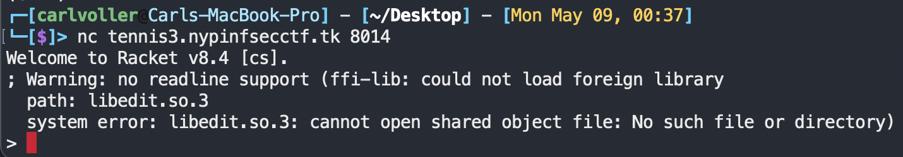

# Tennis Racket 3
## Challenge Description
Damn! My professor found out someone hacked into his computer. Maybe I'll still be able to find something good on there?

## Files
`Program` is the challenge host files and `sol.java` is the solution to the challenge

## Investigation
When you connect to the netcat server, you instantly get dropped into a Racket REPL:



By reading the flag file using the below Racket code,

```racket
#lang racket
(for ([line (file->lines "file.txt")])
  (displayln line))
```

you will get back the flag file content:

```
It seems someone has hacked their way into my computer to try and steal the exam results... thats okay, I've created a super advanced encryption machine they'll never be able to break!
Note to self: Its stored in /encryptor
```

At this point, using Racket to navigate around is way too tedious, so we will be getting ourselves a shell through Racket.

Enter a Shell by using `(system "/bin/bash")`

Once in a bash shell, we can navigate to `/encryptor` and browse all the files.

```bash
> ls
asjd9021qen.java  ljdkabjsho3Shasf.java  output
jbcdksnkcal.java  main.rkt               plmalnnxAS091.java
```

We find a `main.rkt` file, which is probably the entrypoint of whatever program this is, along with a bunch of java files with gibberish names as well as an `output` file.

In the output file we find the following:
```
c1LsoDXs0MTQLg8PqWS3jDOuBI4jj9YNgwIfc8eemBC8XXCvVW9CScK70hi8i5qT
```

Then in `main.rkt`, we find this code:

```racket
#lang racket
(require jni)

;; Construct flag and encryption parameters
(define string "supersecret-")
(set! string (string-append string "NYP{flagwashereohno}"))
(set! string (string-append string "-90384091234-"))
(set! string (string-append string "LVBCS0RGMldpdGhIbWFjU0hBMjU2LQ-"))
(set! string (string-append string "YWpWMk5URnpjekJ3TlRGdVpuVnNJUT09"))

;; This is our native method which will be called from Java
(define (get-name obj)
  (jni-new-string string))

;; Set up the JVM
(current-jni-dump-exceptions? #t)
(define env (get-jni-env))
(current-jni-env env)

;; Register the method
(define encrypt-class (jni-find-class "asjd9021qen"))
(send encrypt-class
      register-natives!
      (list (list "mlad92asda" "()Ljava/lang/String;" get-name)))

;; Create an instance of the Java object
(define encrypt-ctor (send encrypt-class get-method-id "<init>" "()V"))
(define encrypt (jni-new-object encrypt-class encrypt-ctor))

;; Call the native Java method
(define encrypt-mid (send encrypt-class get-method-id "d09IUWaen92__21123" "()Ljava/lang/String;"))
(define encryption (send encrypt call-method encrypt-mid))

(define out (open-output-file "./output" #:exists 'replace))
(write (send encryption get-chars) out)
(close-output-port out)
```

It seems this code uses a library called `jni`, upon google searching we find out that `jni` is actually a Java Native Interface library, that allows Racket to interface with Java and run java code! (Documentation [Here](https://docs.racket-lang.org/jni/index.html))

On lines 5-9 of `main.rkt` we can see the program constructing a string that contains the flag, this code once ran, creates the string 
```
supersecret-NYP{flagwashereohno}-90384091234-LVBCS0RGMldpdGhIbWFjU0hBMjU2LQ-YWpWMk5URnpjekJ3TlRGdVpuVnNJUT09
```

The rest of the code is really complex to understand, but thankfully we don't have to understand it. We already know this file is trying to interface with a java file, the question is which java file? Inside `main.rkt`, we can see the code containing 3 different strings of gibberish as parameters: `asjd9021qen` on line 21, `mlad92asda` on line 24 and `d09IUWaen92__21123` on line 31.

It appears that `asjd9021qen` is actually the name of one of the java files! When we open `asjd9021qen.java`, we can see this code:

```java
class asjd9021qen {

    public String d09IUWaen92__21123() throws NoSuchAlgorithmException, InvalidKeySpecException {

        String[] arr = mlad92asda().split("-");

        ljdkabjsho3Shasf poijdscpniD = new ljdkabjsho3Shasf();
        return poijdscpniD.alsnciqbn3rf(arr[2], arr[0], arr[3], arr[1], arr[4]);
    }

    private native String mlad92asda();

}
```

In this file we also find where `d09IUWaen92__21123` and `mlad92asda` are from. `d09IUWaen92__21123` is a function in the `asjd9021qen` class and `mlad92asda` is a native function waiting to return a String.

So it would make sense that racket's `jni` package is interfacing with the `d09IUWaen92__21123` function inside `asjd9021qen.java` and the `mlad92asda` function.

On line 8 of `asjd9021qen.java`, we now can see the string that racket has constructed earlier is now being split by the `-` symbol, creating an array which contains `["supersecret", "NYP{flagwashereohno}", "90384091234", "LVBCS0RGMldpdGhIbWFjU0hBMjU2LQ-YWpWMk5URnpjekJ3TlRGdVpuVnNJUT09"]`

The program than creates an instance of the class inside `ljdkabjsho3Shasf.java` and passes the split string array into a function on the `ljdkabjsho3Shasf` class in a jumbled order.

Now we follow the code, inside `ljdkabjsho3Shasf.java`, we see this:

```java
class ljdkabjsho3Shasf {

    public String alsnciqbn3rf(String s1, String s2, String s3, String s4, String s5) throws NoSuchAlgorithmException, InvalidKeySpecException {

        String[] asolhfn = new String(Base64.getDecoder().decode(s3)).split("-");
        SecretKeyFactory factory = SecretKeyFactory.getInstance(asolhfn[1]);
        char[] NLSaBJKLS = s1.toCharArray();
        KeySpec spec = new PBEKeySpec(NLSaBJKLS, s2.getBytes(), 65536, 256);
        SecretKey mmmm = new SecretKeySpec(factory.generateSecret(spec).getEncoded(), "AES");

        jbcdksnkcal lashdaslk = new jbcdksnkcal();
        IvParameterSpec ashonlfciasdf = lashdaslk.tgcabjsklnjas(s5);

        return new plmalnnxAS091().lsadmlasjijd(s4, mmmm, ashonlfciasdf);
    }
}
```

By googling documentation for each of these functions and classes, we can figure out that the program is actually doing AES Encryption!

We can see that the `Iv` value for the AES encryption is created from the variable `s5`, which when traced back to our original string contains the value `YWpWMk5URnpjekJ3TlRGdVpuVnNJUT09`.

Inside `jbcdksnkcal.java` which is the file that generates the `Iv` value, we can see that `s5` is actually Base64 decoded twice before being passed to the `IvParameterSpec` function and then being returned to `ljdkabjsho3Shasf.java`.

Finally, the encryption function passes the strings `s4`, `mmmm` and `ashonlfciasdf`, which contains `NYP{flagwashereohno}`, our `Secret Key` and the `Iv` generated to the `plmalnnxAS091.java` file.

Inside `plmalnnxAS091.java`, we can see that AES with mode `AES/CBC/PKCS5PADDING` is performed. The program then returns the encrypted string.

## Solution
In order to decrypt the value found in `output`, we need to reverse this ENTIRE java program.

Thankfully, we already have all the values to do so, subbing in our values from the original string, as well as the AES Mode found in `plmalnnxAS091.java` and `PBEKeySpec` parameters found inside `ljdkabjsho3Shasf.java`, we can now reverse the entire encryption using the solution below:

```java
import java.util.Base64;
import javax.crypto.SecretKey;
import javax.crypto.SecretKeyFactory;
import java.security.spec.KeySpec;
import javax.crypto.SecretKey;
import javax.crypto.spec.PBEKeySpec;
import javax.crypto.Cipher;
import javax.crypto.spec.IvParameterSpec;
import javax.crypto.spec.SecretKeySpec;

class Main {

    public static void main(String[] args) {
        String input = "c1LsoDXs0MTQLg8PqWS3jDOuBI4jj9YNgwIfc8eemBC8XXCvVW9CScK70hi8i5qT";

        try {
            SecretKeyFactory factory = SecretKeyFactory.getInstance("PBKDF2WithHmacSHA256");
            KeySpec spec = new PBEKeySpec("90384091234".toCharArray(), "supersecret".getBytes(), 65536, 256);
            SecretKey key = new SecretKeySpec(factory.generateSecret(spec).getEncoded(), "AES");

            IvParameterSpec ivPS = new IvParameterSpec("j5v51ss0p51nful!".getBytes());

            Cipher cipher = Cipher.getInstance("AES/CBC/PKCS5PADDING");

            cipher.init(2, key, ivPS);

            System.out.println(new String(cipher.doFinal(Base64.getDecoder().decode(input))));
        } catch (Exception e) {
            System.out.println(e);
        }
    }
}
```

One compiled and ran, this program will return the flag
```
NYP{r5ck3t_j5v5_1nt3rf5c3_s0_c00L}
```