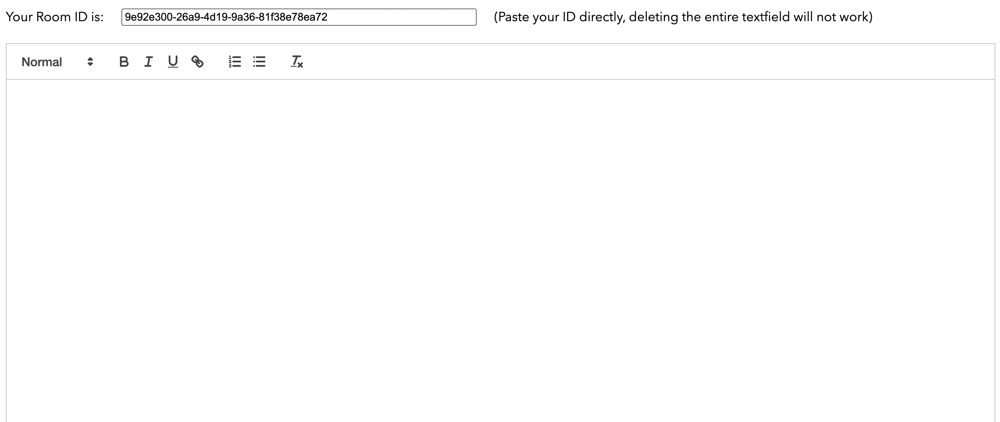
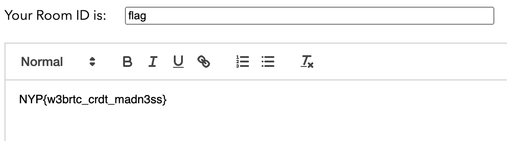

# Quilly.js
## Challenge Description
wow a shared note space where i can write notes with my friends! all i gotta do is share my roomID with my friends and we can all write notes together!

## Files
The hosted website code is in the `website` folder, the source code for the React project is in the `src` folder

## Solution
When you load the webpage, you are given a Quill editor along with a text input to enter a roomID



Next to the text input, the text `(Paste your ID directly, deleting the entire textfield will not work)` already seems a little off, why wouldn't the textbox allow me to type my ID directly?

Upon inspection of the page, it seems that the project was exporting with source map files, this allowed the Chrome inspector to show us the original source code of the page. Particularly, the block within the React's `useEffect` statement is of interest:

```javascript
useEffect(() => {

    if (id === "" || id.length < 5) {
      setID(v4());
      return;
    }

    const editor = quill.current.getEditor();

    let toolbars = Array.from(document.getElementsByClassName("ql-toolbar"));

    for (let i = 0; i < toolbars.length - 1; i++) {
      toolbars[i].remove()
    }

    // 
    //  NOTE: USE FIREFOX WHEN SOLVING THIS CHALLENGE, CHROME OR OTHER CHROMIUM BROWSERS SEEM TO HAVE ISSUES
    //
    const ydoc = new Y.Doc()
    const provider = new WebrtcProvider(id, ydoc, { password: "lmao", signaling: ["wss://quillyjs-stun.nypinfsecctf.tk"] })
    const ytext = ydoc.getText('quill')

    const binding = new QuillBinding(ytext, editor, provider.awareness)

    provider.connect()

    return () => {
      ydoc.destroy();
    }

  }, [quill, id]);
```

At the beginning of the `useEffect`, it is checking for empty IDs of IDs of length < 5, could this be to prevent the user from entering `flag` as the room ID?

The rest of the source code is unfamiliar however it appears to be using `y.js` and `y-webrtc` to establish a WebRTC connection between peers in a room.

Upon looking up the `y-webrtc` documentation for the `WebrtcProvider` constructor, this can be found:

```js
const provider = new WebrtcProvider('your-room-name', ydoc, { signaling: ['wss://y-webrtc-ckynwnzncc.now.sh', 'ws://localhost:4444'] })
```

The `id` variable is the being passed into the WebrtcProvider, this is the variable we want to change. But how can we get around the filter in the `useEffect`?

It appears that the WebrtcProvider uses a public STUN server

`wss://quillyjs-stun.nypinfsecctf.tk`

If we can connect to this public STUN server and recreate this entire application without the `id` filter, we can get the flag.

Since we already have the source code to the entire webpage since the source maps were available in the chrome console, we can reconstruct the entire page locally, omitting the check on `id`.

Recreating the website as in the `solution` folder, you set the id to `flag` and you get the flag:

