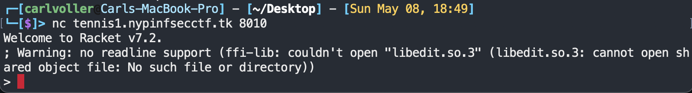

# Tennis Racket
## Challenge Description
I just started my Computer Science Course at NUS last week and my CS prof is teaching us how to use Racket!

He set up a server on his personal computer for us to upload and test our code, I wonder if I can find the answers to next week's test on here heh

## Files
`Program` is the challenge host files and `sol.rkt` is the solution to the challenge

## Solution
When you connect to the netcat server, you instantly get dropped into a Racket REPL:



All you have to do is figure out how to read from `/flag` using Racket, and you get your flag.

Solution:
```racket
(read-line (open-input-file "/flag"))
```
Output:
```
NYP{lisp_or_scheme_idk_anymore}
```